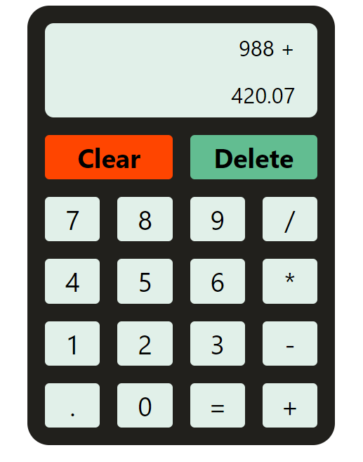

# Calculator
This is a simple implementation of a basic calculator using HTML, CSS, and JavaScript. The project allows the user to perform arithmetic operations such as addition, subtraction, multiplication, and division.

## Demo

[Live](https://calculator-lewocz.netlify.app/)
